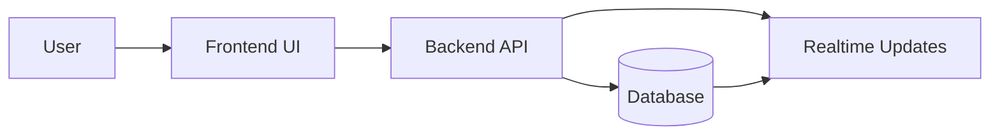
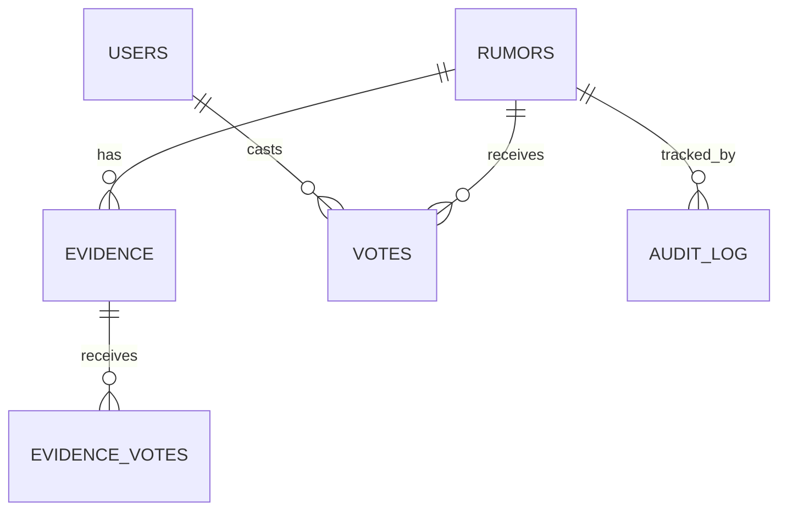
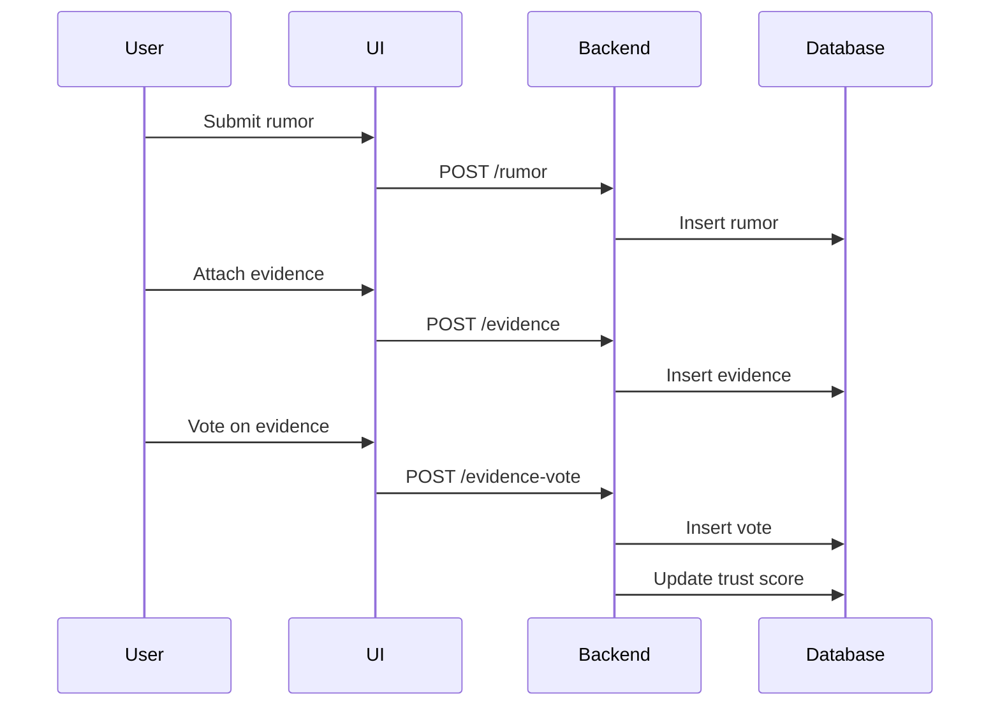

# Project Proposal — CampusWhisper

**Date:** February 6, 2026
**Goal:** Build a trustless, anonymous campus rumor verification system with evidence‑based challenges, Bayesian trust scoring, and anti‑manipulation safeguards — demo‑ready in one hackathon day.

---

## 1) Problem Statement

Campus rumors spread fast, but truth is hard to validate. We need a system where students can submit rumors anonymously, while other students verify or dispute them without any central authority deciding truth. The system must prevent duplicate voting, resist bots, and avoid popularity‑based misinformation. It should also provide an auditable trail of score changes.

---

## 2) Proposed Solution (MVP Scope)

**Core idea:** Evidence‑based challenges + Bayesian trust scoring + bounded popularity, while preserving anonymity via hash‑based vote keys.

### MVP Features (Doable in 10–2)

- Anonymous rumor submission
- Evidence submission (links/images)
- Evidence voting (helpful/misleading)
- **Staking layer** (users can stake points for higher influence)
- Rumor trust score updates (Bayesian, evidence‑weighted)
- Hash‑based duplicate vote prevention
- Log‑scaled vote impact to cap mob influence
- Append‑only audit log for score changes
- Basic bot flags (timing + agreement correlation)

### Stretch / Future Work

- Full trust‑graph anomaly detection
- DAG‑based dependency propagation for rumor deletions
- Automated evidence credibility scoring

---

## 3) Functional Requirements (FRs)

**FR‑1** Users can submit rumors anonymously.

**FR‑2** Users can attach evidence to support or dispute a rumor.

**FR‑3** Users can vote on evidence quality (helpful/misleading).

**FR‑4** The system computes a rumor trust score using Bayesian updates.

**FR‑5** The system prevents duplicate voting per user per rumor via hash‑based vote keys.

**FR‑6** Rumor scores update in real time after evidence votes.

**FR‑7** The system keeps an append‑only audit log of all score changes.

**FR‑8** The system flags suspicious voting patterns and down‑weights them.

**FR‑9** Users can view rumor status (Active / Verified / Debunked / Inconclusive).

---

## 4) Non‑Functional Requirements (NFRs)

**NFR‑1 (Anonymity):** No student identity is stored or linked to votes.

**NFR‑2 (Integrity):** All score updates must be reproducible from the audit log.

**NFR‑3 (Availability):** System should handle high read traffic with minimal latency.

**NFR‑4 (Security):** Hash‑based vote keys must be irreversible and unguessable.

**NFR‑5 (Fairness):** Popularity alone cannot push a rumor above high trust thresholds.

**NFR‑6 (Explainability):** Trust score changes are transparent and auditable.

**NFR‑7 (Performance):** Score updates should compute in under 500ms for a typical vote.

---

## 5) Architecture Overview (Boilerplate‑Agnostic)

- **Frontend:** Provided boilerplate UI framework (to be determined tomorrow)
- **Backend:** Provided boilerplate API layer
- **Database:** Provided storage layer (SQL or NoSQL)
- **Realtime (optional):** If boilerplate supports it, use for live score updates

---

## 6) Data Model (High‑Level)

**Entities:**

- `rumors`
- `evidence`
- `evidence_votes`
- `votes`
- `users` (anonymous token hash)
- `audit_log`

---

## 7) AI Moderation (Optional, Low‑Risk Add‑On)

- **Summarize rumors** for readability
- **Detect duplicates** to reduce spam
- **Flag harmful content** (warning only, no auto‑deletes)

**MVP AI choice:** implement **rumor summarization first** (1–2 lines shown in the feed).

AI never decides truth — only assists the crowd with readability and safety.

---

## 8) Delivery Plan (10:00–2:00 Build Window)

**10:00–10:25** Set up boilerplate, data models, and basic routing

**10:25–11:10** Core API: rumor submission, evidence submission, evidence voting

**11:10–11:40** Bayesian scoring + log scaling + audit log

**11:40–12:10** Frontend feed + evidence UI + score updates

**12:10–12:30** Bot flags (timing + agreement correlation)

**12:30–1:15** Testing + polish

**1:15–2:00** Pitch prep + deploy (using boilerplate’s deploy path)

---

## 9) Submission Deliverables (Text/Markdown Only)

- Complete project code (via boilerplate fork)
- System design diagrams **in Markdown** (Mermaid or ASCII): ERD, flowchart, architecture
- FYP‑style report (this proposal + approach + summary)
- 5‑slide pitch outline (Markdown bullets)
- Demo‑ready application checklist

---

## 10) Judging Criteria Alignment

- **Innovation (20%)** → Evidence‑based verification + DAG ghost fix
- **AI integration depth (25%)** → Summarization + duplicate detection + toxicity warnings
- **Technical execution (25%)** → Bayesian scoring + audit log + anti‑mob scaling
- **Documentation quality (15%)** → Clear mechanisms, assumptions, and diagrams
- **Presentation & demo (15%)** → Live evidence voting → score change → audit log trace

---

## 11) Compliance with Event Rules

- All work done **on‑site** during event hours
- **No prebuilt templates** beyond the provided boilerplate
- **AI APIs integrated on‑site** only
- **Time‑boxed build** to 10:00–2:00

---

## 12) Success Criteria

- Demo shows a rumor gaining/losing trust based on evidence votes
- Duplicate votes are rejected
- Audit log proves score changes
- Popularity alone cannot verify a rumor

---

## 13) Edge Cases & Handling

- **No tokens left:** user can still submit evidence, but can’t vote; earn tokens via evidence upvotes or a daily token drip.
- **Evidence spam:** cap evidence submissions per rumor per user.
- **Duplicate rumors:** AI duplicate detector suggests merge or link to existing rumor.
- **Late evidence:** evidence added after resolution triggers a re‑evaluation window.
- **Coordinated voting spikes:** temporary down‑weighting and audit log flag.
- **Deleted evidence:** removes downstream influence and recomputes affected scores.

---

## 14) Answer to “Should we add ERDs?”

**Yes, add a simple ERD.** It helps judges understand data flow quickly and is easy to include. Keep it minimal (rumors ↔ evidence ↔ evidence_votes, users ↔ votes, audit_log). A one‑page ERD diagram is enough.

---

## 15) Diagram Placeholders (Markdown‑Only)

### Architecture (Mermaid)

### ERD (Mermaid)

### Flow (Mermaid)

